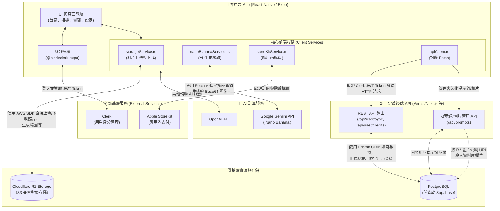

# PopCam App 系統架構圖 (Architecture Diagram)

這份文件描述了 React Native (Expo) 項目的系統架構圖及數據流向。此架構圖旨在幫助理解現有前端與後端、數據庫、以及第三方服務之間的交互邏輯，並為後續開發提供參考。

## 系統架構圖 (System Architecture)

## 架構與數據流說明：

1. **客戶端 (React Native / Expo)**：主要使用 Expo 框架編寫，串接了 React Navigation，負責所有的 UI 和組件（如相機拍攝、本地圖片畫廊、設定頁面等）。
2. **身分驗證 (Clerk)**：通過 `@clerk/clerk-expo` 組件控制登錄狀態。客戶端會先向 Clerk 獲取 JWT 憑證 (Session Token)，後續用這個 Token 請求您的「自定義後端 API」。
3. **自定義後端 API**：作為「信任的中介 (Trusted Middleman)」。過去 App 會直接連接 Supabase，現在已經重構為客戶端先打給您的後端 API，由後端使用 Prisma ORM 去執行驗證身份、扣除點數 (Credits) 和創建用戶 (User Sync) 等敏感操作。
4. **數據庫 (Supabase PostgreSQL + Prisma)**：所有結構化數據（如點數餘額、生成的圖庫歷史 `generated_images`、客製提示詞 `custom_prompts`）都在這裡統一進行操作與關聯。
5. **圖片存儲 (Cloudflare R2)**：為了優化存儲成本，原始上傳圖片與 AI 縮圖都使用 S3 兼容的 Cloudflare R2 保存（透過前端 `storageService.ts` 直接上傳），最後將 R2 的**圖片公開鏈接 (Public URL)** 通過 API 記錄進數據庫。
6. **AI 生成 (Gemini/OpenAI)**：前端客戶端的 `nanoBananaService.ts` 負責發起 AI 請求（主要使用 Google Gemini，也有保留 OpenAI 的服務設定）。將推論結果取得的 Base64 圖片轉檔後上傳 R2，並把生成紀錄寫入資料庫。
